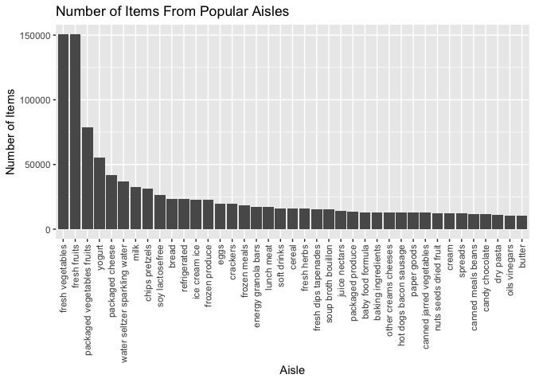
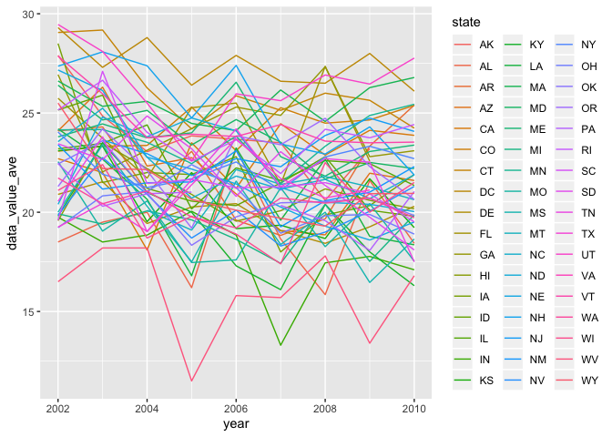
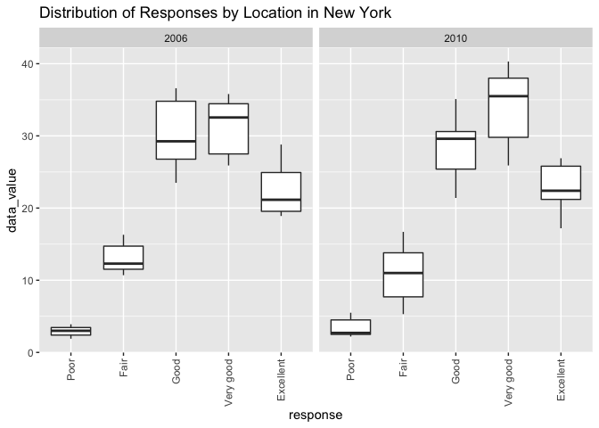
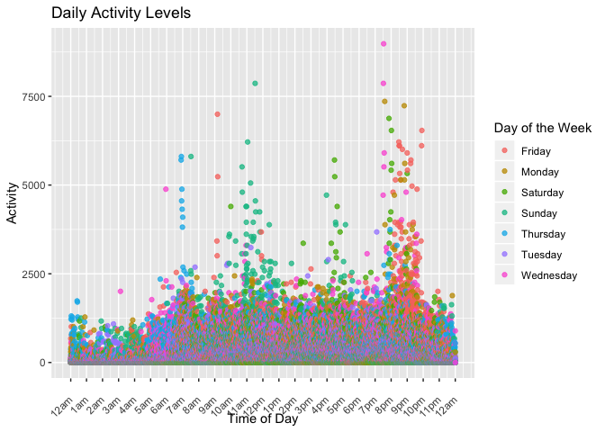

HW 3
================
CC
10/14/2019

## Problem 1

Load libraries

``` r
library(tidyverse)
library(p8105.datasets)
library(knitr)
data(instacart)
```

# Describing the dataset

``` r
instacart %>%
  group_by(aisle) %>%
  summarize(n = n()) %>%
  view()
```

This dataset is quite large, with 1384617 observations from 131,209
unique users. There is a single order per user, and each row represents
a product from an order. For example, user 1 has an order id of 2539329,
which functions as their unique identifier, and they ordered from
instacart on Monday, the second day of the week at 8AM. The 1st item
they added to their cart was Soda, listed in the product name column.
There are a few other variables of interest, including whether or not
the user has ordered an item in the past (reordered) and days since the
user last ordered from instacart (days\_since\_prior\_order). In total
there are 15 variables.

There are 134 aisles, and by far the aisles with the most orders are
fresh veggies and fresh fruits, with over 150,000 items ordered in each.
This is followed by the packaged veggies/fruits aisle, from which about
78,000 items have been ordered. The next most popular aisles include
dairy products like yogurt, packaged cheese, and milk.

# Making a plot

``` r
count(instacart, aisle, name = "aisle_count") %>%
  arrange(desc(aisle_count))
## # A tibble: 134 x 2
##    aisle                         aisle_count
##    <chr>                               <int>
##  1 fresh vegetables                   150609
##  2 fresh fruits                       150473
##  3 packaged vegetables fruits          78493
##  4 yogurt                              55240
##  5 packaged cheese                     41699
##  6 water seltzer sparkling water       36617
##  7 milk                                32644
##  8 chips pretzels                      31269
##  9 soy lactosefree                     26240
## 10 bread                               23635
## # … with 124 more rows
  
plot = 
  instacart %>%
  count(aisle, name = "aisle_count") %>%
  filter(aisle_count > 10000) %>%
  ggplot(aes(x = reorder(aisle, -aisle_count), y = aisle_count)) + geom_bar(stat = "identity") +
  theme(axis.text.x = element_text(angle = 90, hjust = 1, vjust = 0.5)) +
  labs(
    title = "Number of Items From Popular Aisles",
    x = "Aisle",
    y = "Number of Items"
  )
  plot
```

<!-- -->

# Making a table: most popular items in aisles

``` r
instacart %>%
  group_by(product_name, aisle) %>%
  summarize(
    n_ordered = n()) %>%
  group_by(aisle) %>%
  filter(aisle %in% c("baking ingredients", "dog food care", "packaged vegetables fruits"),
         min_rank(desc(n_ordered)) < 4 ) %>%
  arrange(n_ordered, aisle)
## # A tibble: 9 x 3
## # Groups:   aisle [3]
##   product_name                             aisle                  n_ordered
##   <chr>                                    <chr>                      <int>
## 1 Small Dog Biscuits                       dog food care                 26
## 2 Organix Chicken & Brown Rice Recipe      dog food care                 28
## 3 Snack Sticks Chicken & Rice Recipe Dog … dog food care                 30
## 4 Cane Sugar                               baking ingredients           336
## 5 Pure Baking Soda                         baking ingredients           387
## 6 Light Brown Sugar                        baking ingredients           499
## 7 Organic Blueberries                      packaged vegetables f…      4966
## 8 Organic Raspberries                      packaged vegetables f…      5546
## 9 Organic Baby Spinach                     packaged vegetables f…      9784
```

# Making a table: mean hour of the day items are ordered during the week

``` r
fun_food = 
  instacart %>%
  rename(order_hour = order_hour_of_day) %>%
  filter(product_name %in% c("Pink Lady Apples", "Coffee Ice Cream")) %>%
  group_by(product_name, order_dow) %>%
  summarize(mean_hour_of_day = mean(order_hour)) %>%
  mutate(
    day_of_week = recode(order_dow,
                         '0' = "Sunday",
                         '1' = "Monday",
                         '2' = "Tuesday",
                         '3' = "Wednesday",
                         '4' = "Thursday",
                         '5' = "Friday",
                         '6' = "Saturday")) %>%
  separate(mean_hour_of_day, into = c("hour", "minutes"), sep = 2) %>%
  mutate(minutes = as.numeric(minutes),
         minutes = round(minutes*60, digits = 0),
         mean_hour_of_day = paste(hour, minutes, sep = ":")) %>%
  select(product_name, day_of_week, mean_hour_of_day) %>%
  pivot_wider(
    names_from = "product_name",
    values_from = "mean_hour_of_day") %>%
  kable(format = "pandoc", caption = "Mean Hour of Day Items Are Ordered")
fun_food
```

| day\_of\_week | Coffee Ice Cream | Pink Lady Apples |
| :------------ | :--------------- | :--------------- |
| Sunday        | 13:46            | 13:26            |
| Monday        | 14:19            | 11:22            |
| Tuesday       | 15:23            | 11:42            |
| Wednesday     | 15:19            | 14:15            |
| Thursday      | 15:13            | 11:33            |
| Friday        | 12:16            | 12:47            |
| Saturday      | 13:50            | 11:56            |

Mean Hour of Day Items Are Ordered

## Problem 2

``` r
data(brfss_smart2010)

brfss = 
brfss_smart2010 %>%
  janitor::clean_names() %>%
  rename(
    state = locationabbr,
    county = locationdesc,
    cll = confidence_limit_low,
    clh = confidence_limit_high) %>%
  select(-data_value_footnote, -data_value_footnote_symbol, -location_id) %>%
  filter(topic == "Overall Health") %>%
  mutate(response = factor(response, c("Poor", "Fair", "Good", "Very good", "Excellent")))
```

# In 2002, which states were observed at 7 or more locations. What about in 2010?

``` r
brfss_1 = 
  brfss %>%
  filter(year == "2010") %>%
  distinct(state, county) %>%
  count(state) %>%
  filter(n >= 7) %>%
  rename(number_sites = n)
brfss_1
## # A tibble: 14 x 2
##    state number_sites
##    <chr>        <int>
##  1 CA              12
##  2 CO               7
##  3 FL              41
##  4 MA               9
##  5 MD              12
##  6 NC              12
##  7 NE              10
##  8 NJ              19
##  9 NY               9
## 10 OH               8
## 11 PA               7
## 12 SC               7
## 13 TX              16
## 14 WA              10


brfss_2 =
  brfss %>%
  filter(year == "2002") %>%
  distinct(state, county) %>%
  count(state) %>%
  filter(n >= 7) %>%
  rename(number_sites = n)
brfss_2
## # A tibble: 6 x 2
##   state number_sites
##   <chr>        <int>
## 1 CT               7
## 2 FL               7
## 3 MA               8
## 4 NC               7
## 5 NJ               8
## 6 PA              10
```

There were 14 states observed in 2010 at 7 or more locations and 6
states observed in 2002 at 7 or more locations.

# Construct a dataset

``` r
brfss_excellent =  
brfss %>%
  janitor::clean_names() %>%
  filter(response == "Excellent") %>%
  group_by(year, state) %>%
  summarize(data_value_ave = mean(data_value)) %>%
  ggplot(aes(x = year, y = data_value_ave, group = state, color = state)) + geom_line()
brfss_excellent
## Warning: Removed 3 rows containing missing values (geom_path).
```

<!-- -->

# Make a two-panel plot

``` r
data_value_2010 = 
  brfss %>%
  filter(state == "NY", year %in% c("2010", "2006")) %>%
  select(year, response, data_value) %>%
  ggplot(aes(x = response, y = data_value)) + 
  geom_boxplot() +
  facet_grid(~year) +
  theme(axis.text.x = element_text(angle = 90, hjust = 1, vjust = 0.5)) +
  labs(
    title = "Distribution of Responses by Location in New York"
  )
data_value_2010
```

<!-- -->

## Problem 3

``` r
accel = 
  read_csv("accel_data.csv") %>%
  janitor::clean_names() %>%
  pivot_longer(
    activity_1:activity_1440,
    names_to = "activity_number",
    values_to = "activity") %>%
  separate(activity_number, into = c("activity_name", "minute")) %>%
  mutate(
    day_type = if_else(day %in% c("Monday", "Tuesday", "Wednesday", "Thursday", "Friday"), "day", day),
    day_type = if_else(day_type %in% c("Saturday", "Sunday"), "weekend", day_type),
    minute = as.numeric(minute)) %>%
  select(-activity_name) %>%
  rename(
    day_number = day_id,
    day_name = day
  )
accel
## # A tibble: 50,400 x 6
##     week day_number day_name minute activity day_type
##    <dbl>      <dbl> <chr>     <dbl>    <dbl> <chr>   
##  1     1          1 Friday        1     88.4 day     
##  2     1          1 Friday        2     82.2 day     
##  3     1          1 Friday        3     64.4 day     
##  4     1          1 Friday        4     70.0 day     
##  5     1          1 Friday        5     75.0 day     
##  6     1          1 Friday        6     66.3 day     
##  7     1          1 Friday        7     53.8 day     
##  8     1          1 Friday        8     47.8 day     
##  9     1          1 Friday        9     55.5 day     
## 10     1          1 Friday       10     43.0 day     
## # … with 50,390 more rows
```

The resulting dataset has 6 variables with 50400 observations. It now
has a variable defining each activity by number. There is a variable for
the week and day of the study each activity took place as an integer
value, as well as a variable that says what specific day of the week
each activity took place, whether that was a weekday or weekend. Finally
we have an integer minute variable for how the minute in the day that an
activity took place for.

# Aggregating data across minutes

``` r
accel_sum = 
  accel %>%
  group_by(day_number) %>%
  summarize(sum_of_day = sum(activity))
kable(accel_sum, format = "pandoc", caption = "Total Activity Per Day")
```

| day\_number | sum\_of\_day |
| ----------: | -----------: |
|           1 |    480542.62 |
|           2 |     78828.07 |
|           3 |    376254.00 |
|           4 |    631105.00 |
|           5 |    355923.64 |
|           6 |    307094.24 |
|           7 |    340115.01 |
|           8 |    568839.00 |
|           9 |    295431.00 |
|          10 |    607175.00 |
|          11 |    422018.00 |
|          12 |    474048.00 |
|          13 |    423245.00 |
|          14 |    440962.00 |
|          15 |    467420.00 |
|          16 |    685910.00 |
|          17 |    382928.00 |
|          18 |    467052.00 |
|          19 |    371230.00 |
|          20 |    381507.00 |
|          21 |    468869.00 |
|          22 |    154049.00 |
|          23 |    409450.00 |
|          24 |      1440.00 |
|          25 |    260617.00 |
|          26 |    340291.00 |
|          27 |    319568.00 |
|          28 |    434460.00 |
|          29 |    620860.00 |
|          30 |    389080.00 |
|          31 |      1440.00 |
|          32 |    138421.00 |
|          33 |    549658.00 |
|          34 |    367824.00 |
|          35 |    445366.00 |

Total Activity Per Day

``` r
accel_sum
## # A tibble: 35 x 2
##    day_number sum_of_day
##         <dbl>      <dbl>
##  1          1    480543.
##  2          2     78828.
##  3          3    376254 
##  4          4    631105 
##  5          5    355924.
##  6          6    307094.
##  7          7    340115.
##  8          8    568839 
##  9          9    295431 
## 10         10    607175 
## # … with 25 more rows
```

# Making a single panel plot: 24hr activity each day

``` r
plot = accel %>% 
  arrange(minute) %>%
  ggplot(aes(x = minute, y = activity)) +
  geom_point(aes(color = day_name), alpha = 0.75) +
  ylab("Activity") +
  labs(color = "Day of the Week") +
  ggtitle("Daily Activity Levels") +
  scale_x_continuous(
    name = "Time of Day",
    breaks = c(1, 60, 120, 180, 240, 300, 360, 420, 480, 540, 600, 660, 720, 780, 840, 900, 960, 1020, 1080, 1140, 1200, 1260, 1320, 1380, 1440),
    labels = c("12am", "1am", "2am", "3am", "4am", "5am", "6am", "7am", "8am", "9am", "10am", "11am", "12pm", "1pm", "2pm", "3pm", "4pm", "5pm", "6pm", "7pm", "8pm", "9pm", "10pm", "11pm", "12am")) +
  theme(axis.text.x = element_text(angle = 45, hjust = 1, vjust = 0.5))
plot
```

<!-- -->
